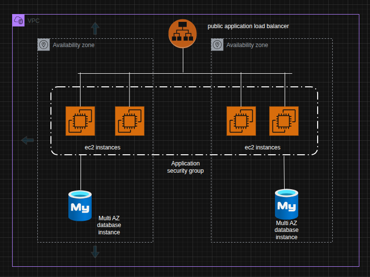

# Simple Page Visit Counter with LAMP Stack

This is a simple web application that counts and displays page visits using the LAMP (Linux, Apache, MySQL, PHP) stack.

## Project Architecture



## Features

- Tracks and displays the number of page visits
- Clean, responsive user interface
- Persistent storage using MySQL database

## Requirements

- PHP 7.0 or higher
- MySQL/MariaDB
- Apache web server
- Web browser

## Installation

1. Clone this repository to your web server directory:
   ```
   git clone https://github.com/yourusername/page_visit_counter.git
   ```

2. Create a MySQL database and table:
   ```sql
   CREATE DATABASE PageVisit;
   USE PageVisit;
   CREATE TABLE page_visits (
     id INT PRIMARY KEY,
     visit_count INT DEFAULT 0
   );
   INSERT INTO page_visits (id, visit_count) VALUES (1, 0);
   ```

3. Update the database connection details in `counter.php` if needed.

4. Access the application through your web browser.

## Usage

Simply navigate to the page in your web browser. Each page load will increment the visit counter and display the current count.

## License

[MIT](LICENSE)